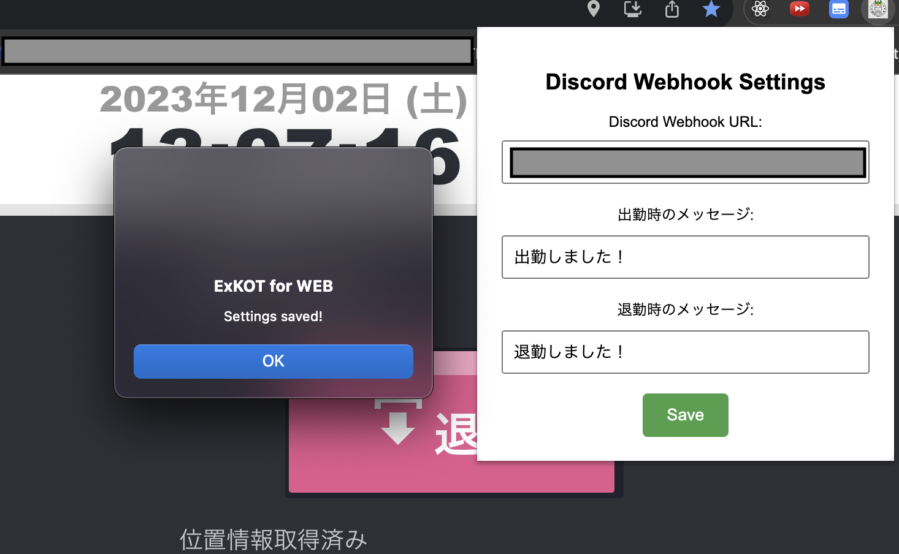
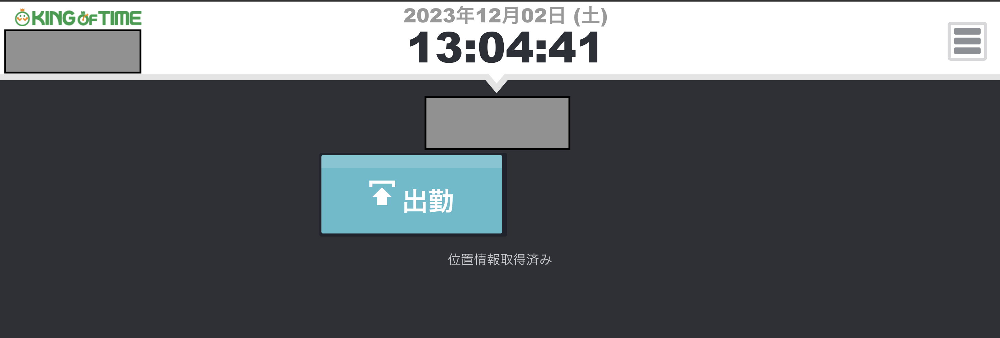
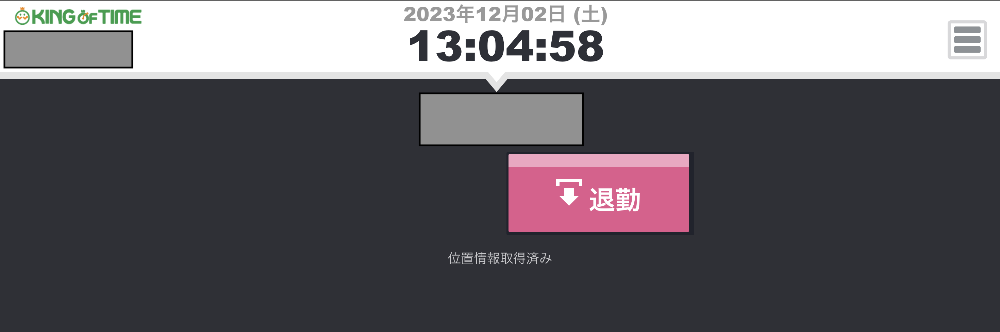

# ExKOT

- [English Version](##English-Version)
- [日本語版](##日本語版)

## English Version

- This project is intended to be published as a Chrome extension.

### Project Description

This Chrome extension aims to enhance the user experience by providing features to prevent consecutive button presses for attendance and leave, as well as the ability to send custom messages to a chosen channel (currently only Discord) when clocking in. The extension also offers a seamless setup process and is designed to be developer-friendly for testing and further development.

### Features

- Display and hide attendance and leave buttons to prevent consecutive presses.

- Ability to send a configured message to a chosen channel (currently only Discord) when clocking in.-

### Usage

To use this Chrome extension, follow these steps:

1. Install the extension from the Chrome Web Store.
   <!-- TODO: Pase the link here. -->

   - [ExKOT](Pase the link here)

2. Configure the following settings in the options panel:

   - Webhook URL (required)
     - currently only for Discord
   - Message for clocking in (optional)
   - Message for clocking out (optional)

     Save the settings.
     

3. Verify that the extension is enabled, and navigate to the actual KOT clocking page.
4. The leave button should be hidden! Now, let's press the attendance button and verify that the configured message is sent to the channel!

- When initially loaded and clocked out
  
- when clocked in
  

## For Developers

- See [Directory Structure](./DIRECTORY.md)

### Setup

- using Volta and pnpm
- See doc: https://docs.volta.sh/guide/ and install volta on your PC.
- install pnpm via volta: https://docs.volta.sh/advanced/pnpm

```sh
# package install
pnpm i

# build
pnpm build:d
```

When testing, open `chrome://extensions/`.
And turn on Developer mode. Then, load the generated `dist` directory of this project using [Load unpacked].

## License

This project is licensed under the [License Name]. For more details, please see the [LICENSE](./LICENSE) file.

## Contributing

Contributions to the project are welcome! For information on how to contribute, please see the [CONTRIBUTING.md](./CONTRIBUTING.md) file.

## 日本語版

このプロジェクトはChrome拡張機能として公開しています。

### プロジェクトの説明

このChrome拡張機能は、連続したボタン押下を防止する機能や、出勤時に選択したチャンネル（現在はDiscordのみ）にカスタムメッセージを送信する機能を提供することで、ユーザーエクスペリエンスを向上させることを目指しています。また、この拡張機能はシームレスなセットアッププロセスを提供し、テストやさらなる開発にも開発者向けに設計されています。

### 機能

- 連続した押下を防止するために出勤および退勤ボタンを表示および非表示にする機能
- 出勤時に選択したチャンネル（現在はDiscordのみ）に設定したメッセージを送信する機能

### 使用方法

このChrome拡張機能を使用するには、以下の手順に従ってください：

1. Chrome Web Storeから拡張機能をインストールします。
2. オプションパネルで以下の設定を行います：

   - WebhookのURL（必須）
   - 出勤時のメッセージ（任意）
   - 退勤時のメッセージ（任意）

     設定を保存します。
     

3. 拡張機能が有効になっていることを確認し、実際にKOTの打刻ページに移動しましょう。
4. 退勤ボタンが非表示になっているはずです！それでは出勤ボタンを押して、設定したメッセージをチャンネルに送られることを確認しましょう！

- 初期ロード時、退勤打刻時
  
- 出勤打刻時
  

### 開発者向け

- [Directory Structure](./DIRECTORY.md)を参照

#### セットアップ

- using Volta and pnpm
- See doc: https://docs.volta.sh/guide/ and install volta on your PC.
- install pnpm via volta: https://docs.volta.sh/advanced/pnpm

```sh
# package install
pnpm i

# build
pnpm build:d
```

テスト時には、`chrome://extensions/` を開いてください。
そして、開発者モードを有効にしてください。その後、このプロジェクトの生成された `dist` ディレクトリを [パッケージ化されていない拡張機能を読み込む] を使用して読み込んでください。

## ライセンス

このプロジェクトは [ライセンス名] のもとでライセンスされています。詳細については、[LICENSE](./LICENSE) ファイルを参照してください。

## 貢献

プロジェクトへの貢献は歓迎します！貢献方法についての情報は、[CONTRIBUTING.md](./CONTRIBUTING.md) ファイルを参照してください。
